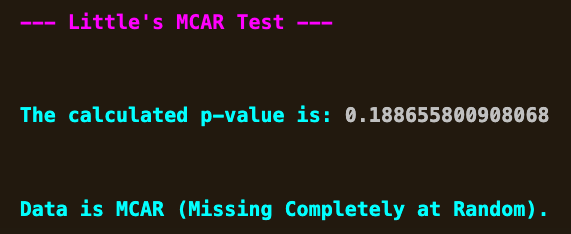
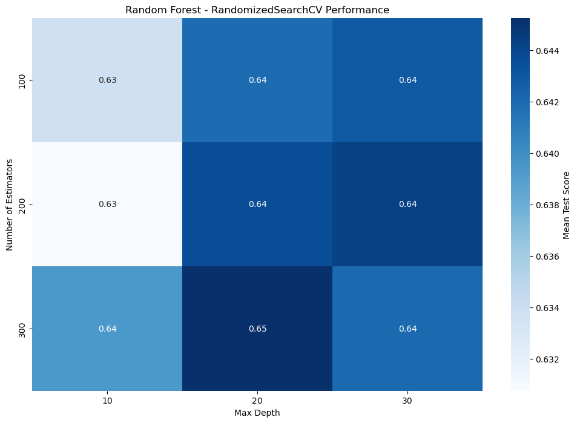

# Aeropolis_AIML_296881

---
# [Section 0] Title and Team Members
- Project Title: Aeropolis
- Group Number: 2
- Team Members:
  - 296881 Guia Ludovica Basso (Captain)
  - 297061 Alessio Giannotti
  - 304011 Yasemin Ateş
    
This is a group project for the Artificial Intelligence and Machine Learning course of LUISS University (a.y. 2024-2025).

---
# [Section 1] Introduction

**Project Overview:** In the futuristic city of Aeropolis, autonomous delivery drones are crucial for the efficient transportation of goods. This project aims to predict the cargo capacity of these drones per flight, considering various environmental and operational factors that affect drone performance. By understanding the influence of conditions such as weather, terrain, and equipment, we aim to improve the operational efficiency of these drones.

---
# [Section 2] Methods
The analysis begins with exploratory data analysis (EDA) to clean the data, handle missing values, identify outliers, and analyze the target variable (cargo capacity). Then we move on to apply and compare machine learning (ML) algorithms to predict cargo capacity.

## Proposed Ideas:
We developed a machine learning model to predict the cargo capacity of delivery drones based on a dataset containing various features. The features include weather conditions, terrain type, and equipment specifications. We applied several models to identify the best one for predicting cargo capacity:

- Random Forest
- Linear Regression
- Gradient Boosting
- XGBoost

We utilized a sample dataset to speed up the experimentation process and reduce computation time, while fully utilizing the computational resources at hand.

## **Environment:** The model was developed using the Python programming language and the following libraries:

- **pandas** for data manipulation
- **numpy** for numerical operations
- **scikit-learn** for machine learning algorithms
- **matplotlib** and seaborn for data visualization
- **rich** for making the output more readable and styled in the console (including tables and colorful text)
- **pyampute** for handling missing data in a structured way, including random imputation
- **math** for statistical functions and advanced calculations
- **missingno** for visualizing missing data and identifying patterns
- **scipy** for statistical functions and advanced calculations
- **warnings** to manage and filter warning messages during the process
- **statsmodels** for statistical modeling and hypothesis testing
- **joblib** for saving and loading machine learning models
- **xgboost** for implementing the XGBoost model, a gradient boosting algorithm
- **builtins** for basic Python functions like input/output handling
- **collections** for “defaultdict” (auto-creating lists for keys)
- **itertools** generates all pairs of categorical and numerical features for plotting
- **statsmodels** for power analysis to calculate the required sample size.

---
### To replicate our environment, follow these instructions:
1. Make sure you have cloned the repository by having ran:
    ```
    git clone https://github.com/yaseminates/Aeropolis_AIML_296881
    ```
3. Change the directory to the cloned repository.
   ```
   cd Aeropolis_AIML_296881
   ```
5. Then run:
    ```
    conda env create -f environment.yml
    conda activate env-aeropolis
    ```
4. Your Terminal should look like this:
    ```
    (env-aeropolis) yourusername@your-machine Aeropolis_AIML_296881 %
    ```
---
## **Flowchart:**


## **Contents of the Jupyter Notebook**


---
## **Data Loading**

The code asks the user to input the file path to the “aeropolis.csv” dataset, unless it already has been manually added. Then we used pandas to read the csv file and created a sample. The user can either choose to work on the original dataset (with 1 million entries) or the sample (the size of which can be adjusted according to one’s needs).

```python

#get the filepath from user and read the data

fileInput = None # manual input

if not fileInput:
    console.print("[bright_cyan]Please enter the path to the file: [/bright_cyan]")
    fileInput = input()

console.print(f"[bright_green]Your filepath is: {fileInput}[/bright_green]")

```

---
## **EDA**
We took an initial look at the first few entries and structure of the data set.
One of the first things we noticed was that Flight_Duration_Minutes contained Booleans instead of the intended float numbers, which led us to discard this column later in the code.

We then provided a quick overview of the dataset by showing the number of rows, columns, and data types, and descriptive statistics.


<div>
<table border="1" class="dataframe">
  <thead>
    <tr style="text-align: right;">
      <th></th>
      <th>Cargo_Capacity_kg</th>
      <th>Air_Temperature_Celsius</th>
      <th>Equipment_Cost</th>
      <th>Water_Usage_liters</th>
      <th>Flight_Hours</th>
      <th>Delivery_Time_Minutes</th>
      <th>Cleaning_Liquid_Usage_liters</th>
      <th>Autopilot_Quality_Index</th>
      <th>Vertical_Max_Speed</th>
      <th>Wind_Speed_kmph</th>
      <th>Route_Optimization_Per_Second</th>
    </tr>
  </thead>
  <tbody>
    <tr>
      <th>count</th>
      <td>899767.000</td>
      <td>900236.000</td>
      <td>900197.000</td>
      <td>900344.000</td>
      <td>900273.000</td>
      <td>900036.000</td>
      <td>899602.000</td>
      <td>900189.000</td>
      <td>899779.000</td>
      <td>900212.000</td>
      <td>899614.000</td>
    </tr>
    <tr>
      <th>mean</th>
      <td>4.650</td>
      <td>27.502</td>
      <td>29987.481</td>
      <td>4999.072</td>
      <td>149.995</td>
      <td>104.483</td>
      <td>50.093</td>
      <td>0.500</td>
      <td>299.316</td>
      <td>550.079</td>
      <td>999.719</td>
    </tr>
    <tr>
      <th>std</th>
      <td>1.696</td>
      <td>7.221</td>
      <td>11548.037</td>
      <td>1500.070</td>
      <td>12.255</td>
      <td>25.945</td>
      <td>50.073</td>
      <td>0.289</td>
      <td>115.500</td>
      <td>259.809</td>
      <td>199.873</td>
    </tr>
    <tr>
      <th>min</th>
      <td>-1.148</td>
      <td>15.000</td>
      <td>10000.140</td>
      <td>-2323.700</td>
      <td>95.000</td>
      <td>60.000</td>
      <td>0.000</td>
      <td>0.000</td>
      <td>100.000</td>
      <td>100.001</td>
      <td>-133.070</td>
    </tr>
    <tr>
      <th>25%</th>
      <td>3.419</td>
      <td>21.253</td>
      <td>19972.210</td>
      <td>3987.088</td>
      <td>142.000</td>
      <td>82.000</td>
      <td>14.450</td>
      <td>0.250</td>
      <td>199.000</td>
      <td>325.136</td>
      <td>864.782</td>
    </tr>
    <tr>
      <th>50%</th>
      <td>4.652</td>
      <td>27.505</td>
      <td>29986.650</td>
      <td>4997.685</td>
      <td>150.000</td>
      <td>104.000</td>
      <td>34.730</td>
      <td>0.500</td>
      <td>299.000</td>
      <td>550.349</td>
      <td>999.750</td>
    </tr>
    <tr>
      <th>75%</th>
      <td>5.879</td>
      <td>33.752</td>
      <td>39990.970</td>
      <td>6011.532</td>
      <td>158.000</td>
      <td>127.000</td>
      <td>69.428</td>
      <td>0.750</td>
      <td>399.000</td>
      <td>774.780</td>
      <td>1134.480</td>
    </tr>
    <tr>
      <th>max</th>
      <td>9.963</td>
      <td>40.000</td>
      <td>49999.990</td>
      <td>13104.200</td>
      <td>213.000</td>
      <td>149.000</td>
      <td>716.380</td>
      <td>1.000</td>
      <td>499.000</td>
      <td>999.998</td>
      <td>1999.670</td>
    </tr>
  </tbody>
</table>
</div>

*For Cargo_Capacity_kg and Water_Usage_liters we noticed the presence of negative values inconsistent with the nature of these features.*

In order to get a better sense of how to deal with missing values later on, we first checked the amount of missing values (which was circa 10% per each feature) and then visualized them in a matrix to identify patterns, guide cleaning strategies, and assess their potential impact on the analysis.

")

This matrix shows a dispersed pattern of missing values, which might suggest randomness, but it is not enough to prove that the data is MCAR (missing completely at random), therefore we went on to further investigate the nature of the missingness through a detailed analysis.

We used a **Chi-Squared Test** to check if the missing values in *"Cargo_Capacity_kg"* are linked to any categorical features in the dataset. For each feature, we created a contingency table and calculated a p-value to see if the relationship was significant (threshold: 0.05).
The results we displayed in the table below show no significant associations (all p-values were above 0.05), indicating that the missing values in *"Cargo_Capacity_kg"* are likely random and not tied to these features. Knowing this, it helped inform our approach to handling the missing data in our analysis.


When visualized, we see that the missing values **follow the pattern of the available data.** In the plots, red represents the distribution of the rows where "Cargo_Capacity_kg" is missing, while blue represents the distribution for the entire dataset. This suggests the missingness in *"Cargo_Capacity_kg"* is random and unrelated to these features, which informs us on how we can handle it.


We used **t-tests** to examine whether the missing values in *"Cargo_Capacity_kg"* are related to any of the numerical features in the dataset. We compared the distributions of each numerical feature for rows with missing *"Cargo_Capcity_kg"* against those without missing values. The p-values from the tests were used to check for significant differences, with a threshold of 0.05.


We observed no strong connections, except for a relationship between Equipment_Cost and the missing *Cargo_Capacity* values. We note this relationship however, do not include it in the predictions, as later on the data is proven to be MCAR (Missing Completely At Random).

These charts compare the numerical features for rows with missing *"Cargo_Capacity_kg"* (red) to the entire dataset (blue). For most features, the missing values look similar to the overall data, which suggests the missingness is probably random and not tied to specific patterns in these features. This helped us handle the data without worrying about introducing bias.

When visualized, we see that the missing values follow the pattern of the available data.


We encoded the categorical values and performed the Little’s MCAR test to determine whether missing data is Missing Completely At Random (MCAR).



The test did confirm our hypothesis that the dataset is generally MCAR, but we decided to explore all relationships across features and found locally non-MCAR relationships.

Our process was calculating p-values of each feature's missing values in relation to other features, then filtering the most significant relationships (with p-values <0.05).


Below is a heatmap that visualizes the local non-MCAR relationships: 


In our initial approach to imputation we accounted for these relationships by using higher-level imputation methods compared to median and mode imputation for the MCAR ones, but we discarded this approach due to bias introduction in the dataset.

We performed Fisher's Exact Test after Little's MCAR Test showed general MCAR behavior to confirm whether missingness in specific variables had any subtle associations with categorical features, ensuring a thorough validation of the randomness assumption. 


---
## **Data Processing**

To ensure the dataset was ready for analysis, we took three main steps: handling outliers, imputing missing values, and removing columns with a mutual information score of zero in relation to our target variable.

---
### **Outlier Handling**

For numerical features, we created a function that detects the percentage of outliers and chooses the appropriate method accordingly:

- Low percentage of outliers: Applied Winsorization to cap extreme values.
- Moderate percentage of outliers: Applied a log transformation to lessen their impact.
- High percentage of outliers: Investigated and potentially removed the most extreme cases.

In this specific case, Winsorization was the only method applied due to the low percentage of outliers. However, we designed a general code that could be potentially applied to future projects of the same nature.


---
### **Extra Steps Taken to Clean Data**

For categorical features, we reviewed the unique values in each column to identify anomalies; 
The only value that sparked our interest was “Unknown” in “Vertical_Landing”, but after checking the amount of instances (30.05% to be exact) we concluded that it had significance in the dataset and kept it.

Additionally, we corrected a typo in the same column, changing "Unsopported" to "Unsupported," though this was not essential for our final objectives.

Before proceeding with imputation, we performed the following data-cleaning steps:

- Dropped all rows missing the target variable, Cargo_Capacity_kg, to avoid introducing bias (more below)
- Removed rows with four or more missing values. This threshold was determined by summing the average number of missing values per row and the standard deviation
- Dropped the Flight_Duration_Minutes column due to a data type mismatch (more below)


---
### **Imputation of Missing Values**

In order to impute missing values we approached numerical and categorical features differently.

Initially, due to the MCAR nature of the dataset, we used median and mode imputation respectively, however, found that this method created artificial “peaks” in the distributions that introduced bias in the final results.

Below is our current imputation method.

To start, we dropped all rows with the target variable (Cargo_Capacity_kg) missing, instead of imputing them, to not introduce a bias even slightly. We are dealing with a target variable in a limited range of mostly 2-6 units with standard deviation values very low (1.6). The majority of our diversity in the variable comes from minimal values. Even the smallest introduction of random values could cause artificial bias.
Post-imputation we print a heatmap to confirm the process.

")

---
#### **Numerical Features**

For numerical features, our priority was maintaining distributions close to the original ones pre-imputation in order not to introduce significant bias. Therefore we used the following methods:

- **Data Augmentation:** For values that were normally distributed, we **generated new data by sampling from a normal distribution based on the mean and standard deviation of the existing data.** This made sense because it ensures the new values fit naturally with the rest of the dataset.


- **Adjusted Random Sampling with noise:** For skewed distributions, we sampled from the existing data but **added a little noise to preserve the skew while avoiding any repetitive patterns.**


- **Uniform Random Imputation:** Finally, for values that were uniformly distributed, we **filled the gaps by picking random numbers within the observed range.** This approach keeps everything consistent with the way the data was originally distributed and ensures the results make sense.

We chose these specific methods because, after trial and error, we found they had the minimal effect on the original distribution shapes. This allowed us to preserve the integrity of the data and ensure the imputed values aligned closely with the natural patterns of the dataset.
Post-imputation we print a heatmap to confirm the process. 

")

We then confirm our highly-skewed distribution’s consistency through calculation.


Then to confirm all distributions were respected, we inspect the post-imputation state of our numerical data. We see that the majority of our distributions stayed the same, with concentrations in the higher and lower ends caused by previous outlier handling. The generated data for the normally distributed values stayed consistent while for Flight_Hours they differed more in comparison to the rest, causing pronounced peaks.


---
#### **Categorical Features**

For categorical features, we imputed the missing values using a placeholder (“Missing”) in order to respect the original distributions. This way, the overall patterns in the data stayed consistent. We chose not to use random noise or arbitrary values because that could have added unnecessary bias or distorted the data, and we wanted to keep things as true to the original as possible.

We note that the data is **MCAR** and there is almost no correlation (proven to be near zero above) between our features, making this imputation have no effect on the distributions of our variables.

Post-imputation we print a heatmap to confirm the process.

")

Then to inspect the finalized distributions, we look at the post-imputation state of our categorical data. We notice that the data stayed the same as expected, since we did not drop or impute pre-existing categories but only added a new one called *“Missing”* as our placeholder.


We notice a previously noted exception in our features in the above charts. It’s the “Flight_Duration_Minutes” column and it contains boolean values in contrast to the expected and needed numerical values. To finalize our missing data handling, we drop the entire column.
 ```python
#drop the column 'Flight_Duration_Minutes'
df_imputed.drop(columns=['Flight_Duration_Minutes'], inplace=True)
console.print('[bold bright_green] Column "Flight_Duration_Minutes" has been dropped from the DataFrame[/bold bright_green]')
 ```

---
### **Mutual Information Scores**

We first used a Pearson Heatmap to explore linear relationships among the variables (including categorical features via one-hot encoding).

From it, we deduced that the only feature our target (Cargo_Capacity_kg) had a high correlation (close to ±1) with is Wind_Speed_kmph.


Due to our target's lack of correlation with the rest of the variables, we decided to move forward with the Mutual Information Score to explore nonlinear relationships that the Heatmap might have failed to capture.

The mutual information scores confirmed that “Wind_Speed_kmph” was the most important feature for predicting "Cargo_Capacity_kg", but it also identified  "Quantum_Battery_True" as the second-most important in the very same task. We also found that although none of the other features had major scores, the relationship still wasn’t zero with many features, as opposed to what the heatmap suggested.

```
Wind_Speed_kmph                  0.346816
Quantum_Battery_True             0.094931
Air_Temperature_Celsius          0.003373
Water_Usage_liters               0.000826
Market_Region_National           0.000670
Weather_Status_Missing           0.000488
Market_Region_Local              0.000420
Vertical_Landing_Unknown         0.000396
Climate_Zone_Polar               0.000302
Climate_Zone_Temperate           0.000301
Vertical_Max_Speed               0.000237
Climate_Zone_Missing             0.000214
Flight_Zone_South                0.000196
Package_Type_Missing             0.000196
Equipment_Cost                   0.000167
Package_Type_Maize               0.000125
Quantum_Battery_Missing          0.000114
Vertical_Landing_Unsupported     0.000091
Terrain_Type_Clay                0.000090
Terrain_Type_Silt                0.000038
Flight_Zone_North                0.000010
Terrain_Type_Sandy               0.000000
Climate_Zone_Tropical            0.000000
Terrain_Type_Missing             0.000000
Flight_Hours                     0.000000
Flight_Zone_Missing              0.000000
Terrain_Type_Peaty               0.000000
Delivery_Time_Minutes            0.000000
Terrain_Type_Loam                0.000000
Route_Optimization_Per_Second    0.000000
Market_Region_Missing            0.000000
Cleaning_Liquid_Usage_liters     0.000000
Vertical_Landing_Supported       0.000000
Package_Type_Wheat               0.000000
Package_Type_Soybean             0.000000
Package_Type_Rice                0.000000
Package_Type_Cotton              0.000000
Weather_Status_Sunny             0.000000
Weather_Status_Rainy             0.000000
Autopilot_Quality_Index          0.000000
Flight_Zone_West                 0.000000
dtype: float64
```


Here we also compare the descriptive statistics of our data pre and post cleaning. We can see that there’s been a small decrease in entry amount as some entries were dropped, the minimum values for “Cargo_Capacity_kg” and “Water_Usage_Liters” have been corrected as they cannot take on negative values realistically. For “Route_Optimization_Per_Second” the negative value is not completely unrealistic however, has been most likely imputed due to being an outlier.

#### **Original Dataset**
<div>
<table border="1" class="dataframe">
  <thead>
    <tr style="text-align: right;">
      <th></th>
      <th>Cargo_Capacity_kg</th>
      <th>Air_Temperature_Celsius</th>
      <th>Equipment_Cost</th>
      <th>Water_Usage_liters</th>
      <th>Flight_Hours</th>
      <th>Delivery_Time_Minutes</th>
      <th>Cleaning_Liquid_Usage_liters</th>
      <th>Autopilot_Quality_Index</th>
      <th>Vertical_Max_Speed</th>
      <th>Wind_Speed_kmph</th>
      <th>Route_Optimization_Per_Second</th>
    </tr>
  </thead>
  <tbody>
    <tr>
      <th>count</th>
      <td>899767.000000</td>
      <td>900236.000000</td>
      <td>900197.000000</td>
      <td>900344.000000</td>
      <td>900273.000000</td>
      <td>900036.000000</td>
      <td>899602.000000</td>
      <td>900189.000000</td>
      <td>899779.000000</td>
      <td>900212.000000</td>
      <td>899614.000000</td>
    </tr>
    <tr>
      <th>mean</th>
      <td>4.649776</td>
      <td>27.502480</td>
      <td>29987.480920</td>
      <td>4999.072438</td>
      <td>149.994980</td>
      <td>104.482616</td>
      <td>50.092852</td>
      <td>0.500285</td>
      <td>299.315963</td>
      <td>550.079136</td>
      <td>999.718546</td>
    </tr>
    <tr>
      <th>std</th>
      <td>1.696381</td>
      <td>7.220540</td>
      <td>11548.037346</td>
      <td>1500.069589</td>
      <td>12.254514</td>
      <td>25.944757</td>
      <td>50.073233</td>
      <td>0.288772</td>
      <td>115.499584</td>
      <td>259.809348</td>
      <td>199.873344</td>
    </tr>
    <tr>
      <th>min</th>
      <td>-1.147613</td>
      <td>15.000041</td>
      <td>10000.140000</td>
      <td>-2323.700000</td>
      <td>95.000000</td>
      <td>60.000000</td>
      <td>0.000000</td>
      <td>0.000000</td>
      <td>100.000000</td>
      <td>100.000896</td>
      <td>-133.070000</td>
    </tr>
    <tr>
      <th>25%</th>
      <td>3.418913</td>
      <td>21.252947</td>
      <td>19972.210000</td>
      <td>3987.087500</td>
      <td>142.000000</td>
      <td>82.000000</td>
      <td>14.450000</td>
      <td>0.250000</td>
      <td>199.000000</td>
      <td>325.135896</td>
      <td>864.782500</td>
    </tr>
    <tr>
      <th>50%</th>
      <td>4.651655</td>
      <td>27.504887</td>
      <td>29986.650000</td>
      <td>4997.685000</td>
      <td>150.000000</td>
      <td>104.000000</td>
      <td>34.730000</td>
      <td>0.500000</td>
      <td>299.000000</td>
      <td>550.349457</td>
      <td>999.750000</td>
    </tr>
    <tr>
      <th>75%</th>
      <td>5.878848</td>
      <td>33.751600</td>
      <td>39990.970000</td>
      <td>6011.532500</td>
      <td>158.000000</td>
      <td>127.000000</td>
      <td>69.427500</td>
      <td>0.750000</td>
      <td>399.000000</td>
      <td>774.780272</td>
      <td>1134.480000</td>
    </tr>
    <tr>
      <th>max</th>
      <td>9.963372</td>
      <td>39.999997</td>
      <td>49999.990000</td>
      <td>13104.200000</td>
      <td>213.000000</td>
      <td>149.000000</td>
      <td>716.380000</td>
      <td>1.000000</td>
      <td>499.000000</td>
      <td>999.998098</td>
      <td>1999.670000</td>
    </tr>
  </tbody>
</table>
</div>

#### **Cleaned Dataset**
<div>
<table border="1" class="dataframe">
  <thead>
    <tr style="text-align: right;">
      <th></th>
      <th>Cargo_Capacity_kg</th>
      <th>Air_Temperature_Celsius</th>
      <th>Equipment_Cost</th>
      <th>Water_Usage_liters</th>
      <th>Flight_Hours</th>
      <th>Delivery_Time_Minutes</th>
      <th>Cleaning_Liquid_Usage_liters</th>
      <th>Autopilot_Quality_Index</th>
      <th>Vertical_Max_Speed</th>
      <th>Wind_Speed_kmph</th>
      <th>Route_Optimization_Per_Second</th>
    </tr>
  </thead>
  <tbody>
    <tr>
      <th>count</th>
      <td>867807.000000</td>
      <td>867807.000000</td>
      <td>867807.00000</td>
      <td>867807.000000</td>
      <td>867807.000000</td>
      <td>867807.000000</td>
      <td>867807.000000</td>
      <td>867807.000000</td>
      <td>867807.000000</td>
      <td>867807.000000</td>
      <td>867807.000000</td>
    </tr>
    <tr>
      <th>mean</th>
      <td>4.649524</td>
      <td>27.507609</td>
      <td>29979.48992</td>
      <td>4999.204721</td>
      <td>149.978008</td>
      <td>104.490557</td>
      <td>49.575428</td>
      <td>0.500400</td>
      <td>299.364014</td>
      <td>550.165561</td>
      <td>999.861456</td>
    </tr>
    <tr>
      <th>std</th>
      <td>1.682060</td>
      <td>7.202810</td>
      <td>11519.10765</td>
      <td>1472.255059</td>
      <td>12.039788</td>
      <td>25.914541</td>
      <td>47.689006</td>
      <td>0.288108</td>
      <td>115.222742</td>
      <td>259.240981</td>
      <td>196.231926</td>
    </tr>
    <tr>
      <th>min</th>
      <td>0.987031</td>
      <td>15.252933</td>
      <td>10398.66520</td>
      <td>-1078.779677</td>
      <td>97.353357</td>
      <td>60.000000</td>
      <td>0.459176</td>
      <td>0.010000</td>
      <td>103.000000</td>
      <td>108.908158</td>
      <td>182.057273</td>
    </tr>
    <tr>
      <th>25%</th>
      <td>3.418245</td>
      <td>21.269717</td>
      <td>19986.78000</td>
      <td>3990.915000</td>
      <td>142.000000</td>
      <td>82.000000</td>
      <td>14.440000</td>
      <td>0.250000</td>
      <td>199.745723</td>
      <td>325.423863</td>
      <td>865.010000</td>
    </tr>
    <tr>
      <th>50%</th>
      <td>4.651375</td>
      <td>27.507292</td>
      <td>29972.94000</td>
      <td>4996.530000</td>
      <td>150.000000</td>
      <td>104.532888</td>
      <td>34.700000</td>
      <td>0.500000</td>
      <td>299.000000</td>
      <td>550.417302</td>
      <td>999.930000</td>
    </tr>
    <tr>
      <th>75%</th>
      <td>5.878557</td>
      <td>33.748964</td>
      <td>39959.81500</td>
      <td>6009.385000</td>
      <td>158.000000</td>
      <td>127.000000</td>
      <td>69.380000</td>
      <td>0.750000</td>
      <td>399.000000</td>
      <td>774.681417</td>
      <td>1134.420000</td>
    </tr>
    <tr>
      <th>max</th>
      <td>8.313635</td>
      <td>39.753615</td>
      <td>49600.73080</td>
      <td>12186.059445</td>
      <td>210.364800</td>
      <td>149.000000</td>
      <td>253.232090</td>
      <td>0.990000</td>
      <td>495.000000</td>
      <td>990.824175</td>
      <td>1913.231631</td>
    </tr>
  </tbody>
</table>
</div>

We removed irrelevant columns with zero mutual information for a more efficient analysis.


Dropping columns with zero mutual information with the target variable before running the models reduced complexity, improved performance, prevented overfitting, accelerated training, and enhanced interpretability by eliminating irrelevant features that did not contribute to target prediction.

After cleaning and processing, the dataset showed significant improvement:
1. **Missing Values Resolved**: All features now have the same number of entries (867,807), ensuring consistency.
2. **Outliers Addressed**: Extreme values were adjusted or removed, reducing variability and improving accuracy.
3. **Data Integrity Maintained**: Key patterns, distributions, and averages were preserved.

Now we can say that the cleaned dataset is well-structured, reliable, and ready for advanced analysis.

---
## **Data Splitting**

We decided to work on a sample of the data for ease of computation, due to having limited computational resources. In order to determine the size of that sample, we performed a power analysis using a small effect size, a 95% confidence level, and a desired power of 80% to calculate the required sample size for a two-sample t-test. The calculation showed that we'd **need at least 17,442 entries per feature** to confidently find real effects.

Therefore we took a small, random 2.5% sample of the entire dataset (equal to 21,695 entries, which exceeds the threshold we just defined). This kept the process faster while still being representative of the full data. Note that the current sample being compared below is the complete sample before having been split. 


We split the data into: 

- **Training set (80%):** This is the largest portion (17,356 rows) used to teach the model.
- **Validation set (10%):** A smaller portion (2,169 rows) used to fine-tune and choose the best model settings.
- **Test set (10%):** Another small portion (2,170 rows) reserved for evaluating the model's performance on unseen data.
  


Splitting the data like this helps ensure the model doesn't only memorize the training data but can also perform well on new, unseen data. It's a key step in building a model that's accurate and reliable.

---
## **Model Selection**
Before selecting the models we had to identify the type of problem we’re dealing with.
The problem is clearly a regression task because the goal is to predict the cargo capacity of a drone, which is a continuous value.

We decided to test the following models: *Linear Regression, Random Forest, XGBoost, and Gradient Boosting.*

The specific reasoning behind our choices can be found in “Section 3: Experimental Design” in this file.

## **Training and Validating**

### **1. Random Forest**

We trained a Random Forest regression model and fine-tuned its settings using RandomizedSearchCV. Instead of going with more complex methods like Bayesian optimization (which require a lot of computational power and careful implementation), we chose random search. It is simpler, faster, and still gets the job done effectively.

We set up a range of possible values for the model's parameters, like the number of trees, (n_estimators) and the depth of the trees (max_depth), along with a few others that affect the model's accuracy. RandomizedSearchCV tested 50 random combinations of these settings using 3-fold cross-validation to figure out which combination worked best.

As the process ran, the model was trained and evaluated for each set of parameters, and we got detailed logs to keep track of progress. In the end, the search found the best setup: 300 trees, a maximum depth of 10, and some additional fine-tuned settings.

Hyperparameter tuning is critical to optimizing a model's performance. Using RandomizedSearchCV allowed us to have a good balance between finding effective parameters and keeping the computational cost manageable.

This step ensures the model is both efficient and accurate for predictions.

  ```python

#RandomizedSearchCV - Tested Parameters
param_dist = {
    'n_estimators': [100, 200, 300],  
    'max_depth': [None, 10, 20, 30],  
    'min_samples_split': [2, 5, 10], 
    'min_samples_leaf': [1, 2, 4], 
    'max_features': ['sqrt', 'log2', None], 
    'bootstrap': [True]  
}
  ```

After running the model we inspect our statistics. 
We evaluated the performance of our Random Forest model using the validation and test sets. Three metrics were used: 

**1. MAE:** Measures how far predictions are from actual values on average (lower is better)
**2. MSE:** Similar to MAE but penalizes larger errors more heavily.
**3. R^2:** Shows how well the model explains the data variability (closer to 1 is better).

The validation set helped us check the model's performance during training, while the test set gave us an idea of how well it performs on unseen data. We presented the results in a table and bar chart, with the test set showing slightly better results, including an R^2 score of **0.673**, meaning the model explains a good portion of the data.

This evaluation confirms that the model is accurate, generalizes well, and isn't overfitting, making it reliable for real-world use.


We created scatter plots to compare the actual values with the predicted values for both the validation set and the test set. The goal was to see how well the model’s predictions align with reality. In both plots, the dashed line represents a perfect match between predictions and actual values.

The points are generally close to this line, showing that the model makes accurate predictions for both validation and test data. However, there’s some scatter, indicating that while the model is performing well. This helps confirm that the model isn’t overfitting and performs consistently on unseen data. 


We looked at which features the **Random Forest model** found most important for making predictions. Using the model’s feature importance scores, we ranked the features and visualized them in a horizontal bar chart. The **most influential features**, like **Wind_Speed_kmph** and **Quantum_Battery_True**, appear at the top to help us understand which factors have the biggest impact on the target variable, for better predictions and future improvements. 


We plotted the residuals (the difference between actual and predicted values) for both the validation and test sets to check the model’s performance. The residuals were scattered around zero, which is a good sign—it means the model's errors are random and not biased. While there’s some scatter, especially for larger predicted values, this is normal and indicates the model is performing reliably overall. This plot helps confirm that the model makes consistent predictions without systematic errors.


We used a heatmap to visualize how different combinations of hyperparameters (number of estimators and max depth) from the **RandomizedSearchCV** results affect the model’s performance. Darker shades represent higher test scores.

The results show consistent performance across most combinations, but higher values for estimators and certain max depths slightly improve the scores. This helps confirm that the chosen parameters are effective and optimized for the model. **The heatmap provides a clear, quick way to evaluate the impact of hyperparameters on performance**.



---
### **2. Linear Regression**

We trained a Ridge Regression model using RandomizedSearchCV to find the best value for the regularization parameter, alpha. After training the model with the optimal parameter, we evaluated its performance on both the validation and test sets.

Key metrics like MAE, MSE, and R^2 were used to assess accuracy. The model performed consistently on both datasets, with the test set showing slightly better results. An R^2 score of 0.6826 on the test set indicates the model explains about 68% of the variability in the target, while the MAE and MSE confirm good prediction accuracy. 


We looked at the coefficients from the **Linear Regression model** to understand how each feature influences the predictions.

A **positive coefficient** means the feature increases the target, while a **negative coefficient** decreases it.

For example, **Quantum_Battery_True** has the largest positive impact, showing it’s a key factor in predictions. On the other hand, features like **Equipment_Cost** and **Vertical_Landing_Unknown** have very small coefficients, meaning they have little effect on the target.

This step helps us see which features are most important, giving us a clearer picture of the relationships in the data and how they drive the model's predictions.


We plotted the **actual vs. predicted values** for both the validation and test sets to check the **performance** of the **Linear Regression model**. The dashed line represents perfect predictions, and the points should ideally cluster around it.

The plots show that the model predicts fairly well, with points generally close to the line. There’s some scatter, especially at the extremes. Overall, the model performs consistently across both datasets, showing it generalizes well to unseen data.


We plotted the residuals (errors) for the validation and test sets to check how well the **Linear Regression model** is performing. Ideally, these errors should be scattered randomly around zero, showing that the predictions are accurate and unbiased.

The plot shows that most of the errors are centered around zero, which is a good sign. However, there’s a bit more scatter for higher predicted values. 


Overall, the Ridge Regression model is well-tuned and performs reliably, making it a strong candidate for further use. 

---
### **3. Extra (not evaluated in the conclusions): Linear regression from Scratch**

We trained a linear regression model using gradient descent, optimizing the learning rate and number of epochs for better accuracy. After testing various combinations, the best setup was a learning rate of 0.01 and 4000 epochs, resulting in a Mean Squared Error (MSE) of 0.9655 and an R^2 score of 0.6605. This means the model explains 66% of the target's variability. Evaluation plots showed the predictions align well with actual values, and residuals were evenly distributed, indicating no bias. Overall, the process successfully tuned the model for accurate and reliable predictions.


---
### **4. Gradient Boosting**

We trained a Gradient Boosting Regressor and used RandomizedSearchCV to find the best hyperparameters efficiently. This approach tested different combinations of parameters like the learning rate, number of trees, tree depth, and sampling strategy. 

  ```python
#RandomizedSearchCV
param_dist = {
    'n_estimators': [100, 200, 300],  
    'learning_rate': [0.01, 0.05, 0.1, 0.2], 
    'max_depth': [3, 5, 7],  
    'min_samples_split': [2, 5, 10], 
    'min_samples_leaf': [1, 2, 4], 
    'subsample': [0.8, 0.9, 1.0]  
}
  ```

With cross-validation we made sure the model's performance was consistent across data subsets. The best configuration we found was:

- Learning rate: 0.05
- Number of trees: 200
- Max depth: 3
- Subsample: 0.8
- Min samples per split: 2
- Min samples per leaf: 1
- 
This setup helps the model balance accuracy and generalization, improving its predictive ability without overfitting.

We tested how well the **Gradient Boosting model** performs on both the validation and test sets by looking at metrics like **MAE**, **MSE**, and **R^2**. The results showed that the model performed consistently across both datasets:

- For the **validation set**, the model had an **MAE of 0.76**, an **MSE of 0.95**, and an **R^2 score of 0.66**.

- On the **test set**, it was just as solid, with an **MAE of 0.74**, an **MSE of 0.91**, and an **R^2 of 0.68**.

This tells us that the model is reliable and does a good job predicting new data, as there isn’t much difference between the validation and test scores. Overall, it’s a strong and dependable model for this task.


We created scatter plots to evaluate how well the **Gradient Boosting model** predicts the target values for both the validation and test sets.

- On the **validation set**, the predicted values are plotted against the actual values, and the points align fairly well with the ideal diagonal line. This indicates the model is performing well on data it hasn't seen during training.

- For the **test set**, we see a similar pattern, with the predictions closely matching the actual values. This shows the model generalizes effectively to completely unseen data.

Overall, these plots confirm that the Gradient Boosting model is making accurate predictions and performs consistently on both validation and test data.


This plot shows the importance of each feature in the **Gradient Boosting model**. It helps us understand which factors had the biggest impact on the model's predictions.

From the chart, **Wind_Speed_kmph** stands out as the most significant feature, followed by **Quantum_Battery_True** and **Air_Temperature_Celsius**. These features contribute the most to the model’s decisions. On the other hand, several features have very low importance, indicating they play a minor role in the predictions. 

This analysis gives us a better understanding of the key drivers behind the model's output and highlights which features matter the most, helping us focus on the most relevant variables for future analysis or optimization.


This plot shows the residuals for the **Gradient Boosting model** on both the validation (blue) and test (green) datasets. 

The key takeaway is that the residuals are spread evenly around zero with no clear patterns, indicating the model is making unbiased predictions. Additionally, the residuals' distribution remains consistent across the range of predicted values, suggesting the model performs reliably without overfitting or underfitting.

We can say that this plot confirms that the **Gradient Boosting model** predicts well, with no major signs of systematic errors or bias.


This heatmap shows the impact of hyperparameters **n_estimators** and **max_depth** on the Gradient Boosting model's test score. The scores are stable across all combinations, around **0.64**, indicating that increasing these parameters further doesn’t improve performance. The results suggest flexibility in parameter choice while saving time and resources during training.


---
### **5. XGBoost**

We trained an XGBoost model using a training dataset with 17,356 samples and 21 features. To optimize the model, we used RandomizedSearchCV to fine-tune key hyperparameters like the number of trees (n_estimators), learning rate, tree depth (max_depth), and regularization parameters (reg_alpha and reg_lambda), among others. 

This process involved testing 20 different parameter combinations with 3-fold cross-validation, totaling 60 model evaluations.

  ```python

#RandomizedSearchCV
param_dist = {
    'n_estimators': [100, 200, 300], 
    'learning_rate': [0.01, 0.05, 0.1, 0.2], 
    'max_depth': [3, 5, 7],  
    'subsample': [0.8, 0.9, 1.0], 
    'colsample_bytree': [0.8, 0.9, 1.0], 
    'gamma': [0, 0.1, 0.2],
    'reg_alpha': [0, 0.01, 0.1], 
    'reg_lambda': [1, 1.5, 2] 
}
  ```

The best-performing hyperparameters found were:

- subsample: 0.8
- reg_lambda: 1.5
- reg_alpha: 0.01
- n_estimators: 100
- max_depth: 5
- learning_rate: 0.05
- gamma: 0.1
- colsample_bytree: 0.8
  
These parameters were chosen because they struck the right balance between model complexity and predictive accuracy, ensuring the model performs well without overfitting. The optimized XGBoost model is now ready for evaluation and application on test data.

We evaluated the performance of our **optimized XGBoost model** on both the validation and test datasets. Key metrics like **Mean Absolute Error (MAE)**, **Mean Squared Error (MSE)**, and **R^2** were calculated to measure prediction accuracy.

- **MAE (average prediction error)** was *0.7645* for validation and *0.7434* for test data.
- **MSE (penalizing larger errors)** came out to *0.9501* for validation and *0.9076* for test data.
- **R^2** was *0.6563* on validation and *0.6783* on test data, showing the model captures a reasonable amount of variability.

The results were visualized with a bar chart, where validation and test metrics closely align, indicating that the model generalizes well and performs reliably across both datasets.


The plots compare the actual values with the predicted values from our **XGBoost model** for both the validation and test datasets.

The validation plot (on the left) and the test plot (on the right) show that the predicted values (blue and green dots) align well with the diagonal "ideal fit" line, which represents perfect predictions. This indicates that the model performs consistently on both datasets and makes accurate predictions without clear signs of overfitting or underfitting. Overall, the model generalizes well to unseen data.


The feature importance plot from the **XGBoost model** gives us a clear picture of which factors had the biggest influence on the predictions.

The top contributors were *"Quantum_Battery_True"* and *"Wind_Speed_kmph"*, with *"Quantum_Battery_Missing"* and *"Air_Temperature_Celsius"* also playing important roles. These features had the most impact on how the model made its predictions.

On the other hand, features like *"Vertical_Landing_Unsupported"* and *"Flight_Zone_South"* contributed very little. This helps us see which factors are truly driving the model's performance, so we can focus on these key variables in future work or decision-making.


This plot helps us understand how well the **XGBoost model** is doing by looking at the residuals.

Ideally, if the model is working well, the residuals should look random and hover evenly around the zero line, meaning the predictions are accurate and unbiased.

Here, the residuals for both the **validation set** *(blue)* and the **test set** *(green)* are spread pretty evenly around zero. This tells us that the model is consistent and is performing similarly on data it was trained on and data it hasn’t seen before. There aren’t any clear patterns or trends in the residuals, which is a good sign. It means the model has captured the main relationships in the data and isn’t overfitting or underfitting.

Overall, the plot suggests that the model is making balanced predictions and doesn’t show any major signs of bias or systematic errors.


This heatmap summarizes the results of the **RandomizedSearchCV** process for tuning the **XGBoost model's hyperparameters**. It shows how different combinations of the number of estimators (y-axis) and the maximum tree depth (x-axis) impact the model's mean test score.
Darker blue areas represent higher test scores, indicating better performance.

The chart reveals that the model consistently achieves solid performance (around 0.64) across many hyperparameter settings, suggesting that it is relatively robust to changes in these parameters within the tested range. This visualization helps pinpoint the best-performing combinations and confirms that our final model is based on well-optimized hyperparameters.


*Note that the NaN value in the middle of our heatmap is likely caused by "not enough fits" in our ML model of 60 fits. We limit the number of folds in favor of computational ease.*

Contrary to our initial assumptions, linear regression was the best performing model.
Though, when concluding this we recall the very similar statistics provided by our above calculations and state that XG Boost and Gradient Boosting were close contenders. Ultimately linear regression was the best choice for our Final Model. 

---
## **Evaluation**

We compared the performance of four models (Random Forest, Linear Regression, Gradient Boosting, and XGBoost) using metrics like RMSE, MAE, MSE, and R^2.

**Linear Regression** consistently came out on top, with the lowest errors (RMSE, MAE, and MSE) and the highest R^2 score, making it the **most accurate model overall**.

We tested four models using the custom scoring formula: **MAE + RMSE - R^2**. This score combines different performance metrics to find the best balance between low prediction errors (MAE and RMSE) and high accuracy (R^2). **The lower the score, the better the model.**

After crunching the numbers, **Linear Regression** emerged as the **best model** with a score of 1.0026, slightly ahead of the others:

- **Random Forest:** 1.0369
- **Gradient Boosting:** 1.0156
- **XGBoost:** 1.0178

---
## **Final Model**

Contrary to our initial assumptions, linear regression was the best performing model.
Though, when concluding this we recall the very similar statistics provided by our above calculations and state that XG Boost and Gradient Boosting were close contenders. Ultimately linear regression was the best choice for our Final Model. 

---
# [Section 3] Experimental Design

## **Main Purpose:**
The goal of this project was to predict the cargo capacity of autonomous drones based on multiple environmental and operational factors.

## **Baselines:**
We compared the performance of our machine learning models against a simple linear regression model, which serves as the baseline.

Other models we used: 
- **RANDOM FOREST:** We used this model because it processes different data types well and catches non-linear relationships. This makes it reliable for complex datasets.
- **GRADIENT BOOSTING:** It minimizes errors iteratively. This makes Gradient Boosting a great choice for modelling complex patterns.
- **XGBOOST:** This model is a faster and more efficient version of Gradient Boosting. It is very accurate and processes missing data very well.


## **Evaluation Metrics:**
We used the following metrics to evaluate our models:

- **Mean Absolute Error (MAE):** Measures the average absolute difference between predicted and actual cargo capacity.
- **Mean Squared Error (MSE):** Measures the average squared difference between predicted and actual cargo capacity.
- **Root Mean Squared Error (RMSE):** Measures the square root of the average squared differences between predicted and actual cargo capacity. It provides an understanding of the magnitude of prediction errors.
- **R-squared (R²):** Indicates how well the model fits the data.

	These metrics allow us to assess the performance of the models both in validation and
	test sets.

---
# [Section 4] Experimental Design

- **Main Findings:**
After evaluating the machine learning models, we found that Linear Regression performed the best in terms of RMSE, MAE, MSE, and R². Despite Gradient Boosting and XGBoost performing competitively, Linear Regression emerged as the top model in all evaluated metrics.

- **Figures/Tables:**
Below are the performance metrics for each model:


The best model by each metric is as follows:
- Best by RMSE: Linear Regression with RMSE = 0.9462
- Best by MAE: Linear Regression with MAE = 0.7391
- Best by MSE: Linear Regression with MSE = 0.8953
- Best by R²: Linear Regression with R² = 0.6826


Additionally, these metrics were visualized through bar charts comparing the models' performance.

A bar chart showing the comparison of model performance across different metrics: RMSE, MAE, MSE, and R².

We used log plots to exaggerate the difference.


Another bar chart showing the comparison of model performance using a custom score.

This calculation combines the MAE (Mean Absolute Error), RMSE (Root Mean Squared Error), and R² (R-squared). 

The formula used for the score is: MAE + RMSE - R², where a lower score is better, indicating a model with lower error and higher R². 


This chart gives us a side-by-side look at how our four different models — **Random Forest, Linear Regression, Gradient Boosting, and XGBoost** — perform by comparing their predicted values to the actual values for both validation and test datasets.

Each plot shows how closely the model’s predictions align with the diagonal "ideal fit" line. From what we can see, there isn’t an obvious difference between the models in these visualizations. They all seem to follow the general trend pretty well, so any differences in performance might not be immediately noticeable here. 


---
# [Section 5] Conclusions

After comparing the performance of the four models—Random Forest, Linear Regression, Gradient Boosting, and XGBoost—we can state that Linear Regression outperforms the others in all key metrics like MAE, RMSE, and R^2, debunking our original belief that the Random Forest Model would outperform it.

Specifically, Linear Regression has the lowest RMSE (0.9462), MAE (0.7391), and MSE (0.8953), while also achieving the highest R² (0.6826). This suggests it provides the most accurate predictions and explains the most variance in the data.

That said, the differences between the models are not very large. Random Forest (RMSE = 0.9605, R² = 0.6730), Gradient Boosting (RMSE = 0.9516, R² = 0.6790), and XGBoost (RMSE = 0.9527, R² = 0.6783) all performed relatively similarly and had only marginally higher errors or lower R² values compared to Linear Regression. This indicates that, while the models might be capturing some additional complexities in the data, their performance doesn’t differ drastically from the simpler Linear Regression model.

In summary, Linear Regression provides the best results overall, but the other models aren't too far behind in comparison.

## **Unanswered Questions and Future Work:**

- There must be clarification to how data is being collected, due to the presence of incoherent negative values and data-type mismatch

- Questions could be expanded to finding out the reasoning behind the near-zero correlation between values leading us to believe the cargo capacity might not be a value that can be optimized. It simply might not be reliant on external factors. This can be caused by the drone delivery system being extremely capable and having handled all cargo in all climates and terrains with no problem, for example.  

- Adding onto the questions above, we have no reason to believe the drones were tested in extreme enough environments or that the parameters had been diverse enough (e.g. cargo loads of <100g or >100kg), of course keeping in mind the capabilities of the vehicle. We do not know what country, what season, or in what time span the data was collected; leaving us unable to confidently conclude our analysis. 


