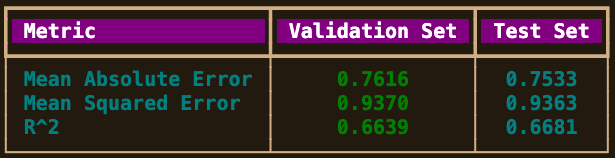

# Aeropolis_AIML_296881

---
# [Section 0] Title and Team Members
- Project Title: Aeropolis
- Group Number: 2
- Team Members:
  - 296881 Guia Ludovica Basso (Captain)
  - 297061 Alessio Giannotti
  - 304011 Yasemin Ateş
    
This is a group project for the Artificial Intelligence and Machine Learning course of LUISS University (a.y. 2024-2025).

---
***Please refer to the Jupyter Notebook for a detailed version of this analysis.***


---
# [Section 1] Introduction

**Project Overview:** In the futuristic city of Aeropolis, autonomous delivery drones are crucial for the efficient transportation of goods. This project aims to predict the cargo capacity of these drones per flight, considering various environmental and operational factors that affect drone performance. By understanding the influence of conditions such as weather, terrain, and equipment, we aim to improve the operational efficiency of these drones.

---
# [Section 2] Methods
The analysis begins with exploratory data analysis (EDA) to clean the data, handle missing values, identify outliers, and analyze the target variable (cargo capacity). Then we move on to apply and compare machine learning (ML) algorithms to predict cargo capacity.

## Proposed Ideas:
We developed a machine learning model to predict the cargo capacity of delivery drones based on a dataset containing various features. The features include weather conditions, terrain type, and equipment specifications. We applied several models to identify the best one for predicting cargo capacity:

- Random Forest
- Linear Regression
- Gradient Boosting
- XGBoost

We utilized a sample dataset to speed up the experimentation process and reduce computation time, while fully utilizing the computational resources at hand.

---
### To replicate our environment, follow these instructions:
1. Make sure you have cloned the repository by having ran:
    ```
    git clone https://github.com/yaseminates/Aeropolis_AIML_296881
    ```
3. Change the directory to the cloned repository.
   ```
   cd Aeropolis_AIML_296881
   ```
5. Then run:
    ```
    conda env create -f environment.yml
    conda activate env-aeropolis
    ```
4. Your Terminal should look like this:
    ```
    (env-aeropolis) yourusername@your-machine Aeropolis_AIML_296881 %
    ```
---
## **Flowchart:**

---
## **Data Loading**

The code asks the user to input the file path to the “aeropolis.csv” dataset, unless it already has been manually added. Then we used pandas to read the csv file and created a sample. The user can either choose to work on the original dataset (with 1 million entries) or the sample (the size of which can be adjusted according to one’s needs).

```python

#get the filepath from user and read the data

fileInput = None # manual input

if not fileInput:
    console.print("[bright_cyan]Please enter the path to the file: [/bright_cyan]")
    fileInput = input()

console.print(f"[bright_green]Your filepath is: {fileInput}[/bright_green]")

```

---
## **EDA**
We took an initial look at the first few entries and structure of the data set.
One of the first things we noticed was that Flight_Duration_Minutes contained Booleans instead of the intended float numbers, which led us to discard this column later in the code.

We then provided a quick overview of the dataset by showing the number of rows, columns, and data types, and descriptive statistics.


*For Cargo_Capacity_kg and Water_Usage_liters we noticed the presence of negative values inconsistent with the nature of these features.*

In order to get a better sense of how to deal with missing values later on, we first checked the amount of missing values (which was circa 10% per each feature) and then visualized them in a matrix to identify patterns, guide cleaning strategies, and assess their potential impact on the analysis.

")

This matrix shows a dispersed pattern of missing values, which might suggest randomness, but it is not enough to prove that the data is MCAR (missing completely at random), therefore we went on to further investigate the nature of the missingness through a detailed analysis.

We used a **Chi-Squared Test** to check if the missing values in *"Cargo_Capacity_kg"* are linked to any categorical features in the dataset. For each feature, we created a contingency table and calculated a p-value to see if the relationship was significant (threshold: 0.05).
The results we displayed in the table below show no significant associations (all p-values were above 0.05), indicating that the missing values in *"Cargo_Capacity_kg"* are likely random and not tied to these features. Knowing this, it helped inform our approach to handling the missing data in our analysis.


When visualized, we see that the missing values **follow the pattern of the available data.** In the plots, red represents the distribution of the rows where "Cargo_Capacity_kg" is missing, while blue represents the distribution for the entire dataset. This suggests the missingness in *"Cargo_Capacity_kg"* is random and unrelated to these features, which informs us on how we can handle it.

We used **t-tests** to examine whether the missing values in *"Cargo_Capacity_kg"* are related to any of the numerical features in the dataset. We compared the distributions of each numerical feature for rows with missing *"Cargo_Capcity_kg"* against those without missing values. The p-values from the tests were used to check for significant differences, with a threshold of 0.05.


We observed no strong connections, except for a relationship between Equipment_Cost and the missing *Cargo_Capacity* values. We note this relationship however, do not include it in the predictions, as later on the data is proven to be MCAR (Missing Completely At Random).

These charts compare the numerical features for rows with missing *"Cargo_Capacity_kg"* (red) to the entire dataset (blue). For most features, the missing values look similar to the overall data, which suggests the missingness is probably random and not tied to specific patterns in these features. This helped us handle the data without worrying about introducing bias.

---
## **Data Processing**

To ensure the dataset was ready for analysis, we took three main steps: handling outliers, imputing missing values, and removing columns with a mutual information score of zero in relation to our target variable.

---
### **Outlier Handling**

For numerical features, we created a function that detects the percentage of outliers and chooses the appropriate method accordingly:

- Low percentage of outliers: Applied Winsorization to cap extreme values.
- Moderate percentage of outliers: Applied a log transformation to lessen their impact.
- High percentage of outliers: Investigated and potentially removed the most extreme cases.

In this specific case, Winsorization was the only method applied due to the low percentage of outliers. However, we designed a general code that could be potentially applied to future projects of the same nature.


---
### **Imputation of Missing Values**

In order to impute missing values we approached numerical and categorical features differently.

Initially, due to the MCAR nature of the dataset, we used median and mode imputation respectively, however, found that this method created artificial “peaks” in the distributions that introduced bias in the final results.

Below is our current imputation method.

To start, we dropped all rows with the target variable (Cargo_Capacity_kg) missing, instead of imputing them, to not introduce a bias even slightly. We are dealing with a target variable in a limited range of mostly 2-6 units with standard deviation values very low (1.6). The majority of our diversity in the variable comes from minimal values. Even the smallest introduction of random values could cause artificial bias.

---
#### **Numerical Features**

For numerical features, our priority was maintaining distributions close to the original ones pre-imputation in order not to introduce significant bias. Therefore we used the following methods:

- **Data Augmentation:** For values that were normally distributed

- **Adjusted Random Sampling with noise:** For skewed distributions

- **Uniform Random Imputation:** For values that were uniformly distributed
  
")

Then to confirm all distributions were respected, we inspect the post-imputation state of our numerical data. 


---
#### **Categorical Features**

For categorical features, we imputed the missing values using a placeholder (“Missing”) in order to respect the original distributions. We note that the data is **MCAR** and there is almost no correlation (proven to be near zero above) between our features, making this imputation have no effect on the distributions of our variables.

Post-imputation we print a heatmap to confirm the process.

")

 ```python
#drop the column 'Flight_Duration_Minutes'
df_imputed.drop(columns=['Flight_Duration_Minutes'], inplace=True)
console.print('[bold bright_green] Column "Flight_Duration_Minutes" has been dropped from the DataFrame[/bold bright_green]')
 ```

---
## **Data Splitting**

We decided to work on a sample of the data for ease of computation, due to having limited computational resources. We split the data into: 

- **Training set (80%):** This is the largest portion (17,356 rows) used to teach the model.
- **Validation set (10%):** A smaller portion (2,169 rows) used to fine-tune and choose the best model settings.
- **Test set (10%):** Another small portion (2,170 rows) reserved for evaluating the model's performance on unseen data.
  
---
## **Model Selection**

We decided to test the following models: *Linear Regression, Random Forest, XGBoost, and Gradient Boosting. The specific reasoning behind our choices can be found in “Section 3: Experimental Design” in this file.

## **Training and Validating**

### **1. Random Forest**

We trained a Random Forest regression model and fine-tuned its settings using RandomizedSearchCV. Instead of going with more complex methods like Bayesian optimization (which require a lot of computational power and careful implementation), we chose random search. It is simpler, faster, and still gets the job done effectively.

We set up a range of possible values for the model's parameters, like the number of trees, (n_estimators) and the depth of the trees (max_depth), along with a few others that affect the model's accuracy. RandomizedSearchCV tested 50 random combinations of these settings using 3-fold cross-validation to figure out which combination worked best.

As the process ran, the model was trained and evaluated for each set of parameters, and we got detailed logs to keep track of progress. In the end, the search found the best setup: 300 trees, a maximum depth of 10, and some additional fine-tuned settings.

Hyperparameter tuning is critical to optimizing a model's performance. Using RandomizedSearchCV allowed us to have a good balance between finding effective parameters and keeping the computational cost manageable.

This step ensures the model is both efficient and accurate for predictions.

  ```python

#RandomizedSearchCV - Tested Parameters
param_dist = {
    'n_estimators': [100, 200, 300],  
    'max_depth': [None, 10, 20, 30],  
    'min_samples_split': [2, 5, 10], 
    'min_samples_leaf': [1, 2, 4], 
    'max_features': ['sqrt', 'log2', None], 
    'bootstrap': [True]  
}
  ```

After running the model we inspect our statistics. 
We evaluated the performance of our Random Forest model using the validation and test sets. Three metrics were used: 

**1. MAE:** Measures how far predictions are from actual values on average (lower is better)
**2. MSE:** Similar to MAE but penalizes larger errors more heavily.
**3. R^2:** Shows how well the model explains the data variability (closer to 1 is better).

The validation set helped us check the model's performance during training, while the test set gave us an idea of how well it performs on unseen data. We presented the results in a table and bar chart, with the test set showing slightly better results, including an R^2 score of **0.673**, meaning the model explains a good portion of the data.

This evaluation confirms that the model is accurate, generalizes well, and isn't overfitting, making it reliable for real-world use.


We used a heatmap to visualize how different combinations of hyperparameters (number of estimators and max depth) from the **RandomizedSearchCV** results affect the model’s performance. Darker shades represent higher test scores.

The results show consistent performance across most combinations, but higher values for estimators and certain max depths slightly improve the scores. This helps confirm that the chosen parameters are effective and optimized for the model. **The heatmap provides a clear, quick way to evaluate the impact of hyperparameters on performance**.


---
### **2. Linear Regression**

We trained a Ridge Regression model using RandomizedSearchCV to find the best value for the regularization parameter, alpha. After training the model with the optimal parameter, we evaluated its performance on both the validation and test sets.

Key metrics like MAE, MSE, and R^2 were used to assess accuracy. The model performed consistently on both datasets, with the test set showing slightly better results. An R^2 score of 0.6826 on the test set indicates the model explains about 68% of the variability in the target, while the MAE and MSE confirm good prediction accuracy. 


Overall, the Ridge Regression model is well-tuned and performs reliably, making it a strong candidate for further use. 

---
### **3. Extra (not evaluated in the conclusions): Linear regression from Scratch**

We trained a linear regression model using gradient descent, optimizing the learning rate and number of epochs for better accuracy. After testing various combinations, the best setup was a learning rate of 0.01 and 4000 epochs, resulting in a Mean Squared Error (MSE) of 0.9655 and an R^2 score of 0.6605. This means the model explains 66% of the target's variability. Evaluation plots showed the predictions align well with actual values, and residuals were evenly distributed, indicating no bias. Overall, the process successfully tuned the model for accurate and reliable predictions.


---
### **4. Gradient Boosting**

We trained a Gradient Boosting Regressor and used RandomizedSearchCV to find the best hyperparameters efficiently. This approach tested different combinations of parameters like the learning rate, number of trees, tree depth, and sampling strategy. 

  ```python
#RandomizedSearchCV
param_dist = {
    'n_estimators': [100, 200, 300],  
    'learning_rate': [0.01, 0.05, 0.1, 0.2], 
    'max_depth': [3, 5, 7],  
    'min_samples_split': [2, 5, 10], 
    'min_samples_leaf': [1, 2, 4], 
    'subsample': [0.8, 0.9, 1.0]  
}
  ```

With cross-validation we made sure the model's performance was consistent across data subsets. The best configuration we found was:

- Learning rate: 0.05
- Number of trees: 200
- Max depth: 3
- Subsample: 0.8
- Min samples per split: 2
- Min samples per leaf: 1
  
This setup helps the model balance accuracy and generalization, improving its predictive ability without overfitting.

We tested how well the **Gradient Boosting model** performs on both the validation and test sets by looking at metrics like **MAE**, **MSE**, and **R^2**. The results showed that the model performed consistently across both datasets:

- For the **validation set**, the model had an **MAE of 0.76**, an **MSE of 0.95**, and an **R^2 score of 0.66**.

- On the **test set**, it was just as solid, with an **MAE of 0.74**, an **MSE of 0.91**, and an **R^2 of 0.68**.

This tells us that the model is reliable and does a good job predicting new data, as there isn’t much difference between the validation and test scores. Overall, it’s a strong and dependable model for this task.


---
### **5. XGBoost**

We trained an XGBoost model using a training dataset with 17,356 samples and 21 features. To optimize the model, we used RandomizedSearchCV to fine-tune key hyperparameters like the number of trees (n_estimators), learning rate, tree depth (max_depth), and regularization parameters (reg_alpha and reg_lambda), among others. 

This process involved testing 20 different parameter combinations with 3-fold cross-validation, totaling 60 model evaluations.

  ```python

#RandomizedSearchCV
param_dist = {
    'n_estimators': [100, 200, 300], 
    'learning_rate': [0.01, 0.05, 0.1, 0.2], 
    'max_depth': [3, 5, 7],  
    'subsample': [0.8, 0.9, 1.0], 
    'colsample_bytree': [0.8, 0.9, 1.0], 
    'gamma': [0, 0.1, 0.2],
    'reg_alpha': [0, 0.01, 0.1], 
    'reg_lambda': [1, 1.5, 2] 
}
  ```

The best-performing hyperparameters found were:

- subsample: 0.8
- reg_lambda: 1.5
- reg_alpha: 0.01
- n_estimators: 100
- max_depth: 5
- learning_rate: 0.05
- gamma: 0.1
- colsample_bytree: 0.8
  
These parameters were chosen because they struck the right balance between model complexity and predictive accuracy, ensuring the model performs well without overfitting. The optimized XGBoost model is now ready for evaluation and application on test data.

We evaluated the performance of our **optimized XGBoost model** on both the validation and test datasets. Key metrics like **Mean Absolute Error (MAE)**, **Mean Squared Error (MSE)**, and **R^2** were calculated to measure prediction accuracy.

- **MAE (average prediction error)** was *0.7645* for validation and *0.7434* for test data.
- **MSE (penalizing larger errors)** came out to *0.9501* for validation and *0.9076* for test data.
- **R^2** was *0.6563* on validation and *0.6783* on test data, showing the model captures a reasonable amount of variability.

The results were visualized with a bar chart, where validation and test metrics closely align, indicating that the model generalizes well and performs reliably across both datasets.




*Note that the NaN value in the middle of our heatmap is likely caused by "not enough fits" in our ML model of 60 fits. We limit the number of folds in favor of computational ease.*

Contrary to our initial assumptions, linear regression was the best performing model.
Though, when concluding this we recall the very similar statistics provided by our above calculations and state that XG Boost and Gradient Boosting were close contenders. Ultimately linear regression was the best choice for our Final Model. 

---
## **Evaluation**

We compared the performance of four models (Random Forest, Linear Regression, Gradient Boosting, and XGBoost) using metrics like RMSE, MAE, MSE, and R^2.

**Linear Regression** consistently came out on top, with the lowest errors (RMSE, MAE, and MSE) and the highest R^2 score, making it the **most accurate model overall**.

We tested four models using the custom scoring formula: **MAE + RMSE - R^2**. This score combines different performance metrics to find the best balance between low prediction errors (MAE and RMSE) and high accuracy (R^2). **The lower the score, the better the model.**

After crunching the numbers, **Linear Regression** emerged as the **best model** with a score of 1.0026, slightly ahead of the others:

- **Random Forest:** 1.0369
- **Gradient Boosting:** 1.0156
- **XGBoost:** 1.0178

---
## **Final Model**

Contrary to our initial assumptions, linear regression was the best performing model.
Though, when concluding this we recall the very similar statistics provided by our above calculations and state that XG Boost and Gradient Boosting were close contenders. Ultimately linear regression was the best choice for our Final Model. 

---
# [Section 3] Experimental Design

## **Main Purpose:**
The goal of this project was to predict the cargo capacity of autonomous drones based on multiple environmental and operational factors.

## **Baselines:**
We compared the performance of our machine learning models against a simple linear regression model, which serves as the baseline.

Other models we used: 
- **RANDOM FOREST:** We used this model because it processes different data types well and catches non-linear relationships. This makes it reliable for complex datasets.
- **GRADIENT BOOSTING:** It minimizes errors iteratively. This makes Gradient Boosting a great choice for modelling complex patterns.
- **XGBOOST:** This model is a faster and more efficient version of Gradient Boosting. It is very accurate and processes missing data very well.


## **Evaluation Metrics:**
We used the following metrics to evaluate our models:

- **Mean Absolute Error (MAE):** Measures the average absolute difference between predicted and actual cargo capacity.
- **Mean Squared Error (MSE):** Measures the average squared difference between predicted and actual cargo capacity.
- **Root Mean Squared Error (RMSE):** Measures the square root of the average squared differences between predicted and actual cargo capacity. It provides an understanding of the magnitude of prediction errors.
- **R-squared (R²):** Indicates how well the model fits the data.

	These metrics allow us to assess the performance of the models both in validation and
	test sets.

---
# [Section 4] Experimental Design

- **Main Findings:**
After evaluating the machine learning models, we found that Linear Regression performed the best in terms of RMSE, MAE, MSE, and R². Despite Gradient Boosting and XGBoost performing competitively, Linear Regression emerged as the top model in all evaluated metrics.

- **Figures/Tables:**
Below are the performance metrics for each model:


The best model by each metric is as follows:
- Best by RMSE: Linear Regression with RMSE = 0.9462
- Best by MAE: Linear Regression with MAE = 0.7391
- Best by MSE: Linear Regression with MSE = 0.8953
- Best by R²: Linear Regression with R² = 0.6826


Additionally, these metrics were visualized through bar charts comparing the models' performance.

A bar chart showing the comparison of model performance across different metrics: RMSE, MAE, MSE, and R².

We used log plots to exaggerate the difference.


Another bar chart showing the comparison of model performance using a custom score.

This calculation combines the MAE (Mean Absolute Error), RMSE (Root Mean Squared Error), and R² (R-squared). 

The formula used for the score is: MAE + RMSE - R², where a lower score is better, indicating a model with lower error and higher R². 


This chart gives us a side-by-side look at how our four different models — **Random Forest, Linear Regression, Gradient Boosting, and XGBoost** — perform by comparing their predicted values to the actual values for both validation and test datasets.

Each plot shows how closely the model’s predictions align with the diagonal "ideal fit" line. From what we can see, there isn’t an obvious difference between the models in these visualizations. They all seem to follow the general trend pretty well, so any differences in performance might not be immediately noticeable here. 


---
# [Section 5] Conclusions

After comparing the performance of the four models—Random Forest, Linear Regression, Gradient Boosting, and XGBoost—we can state that Linear Regression outperforms the others in all key metrics like MAE, RMSE, and R^2, debunking our original belief that the Random Forest Model would outperform it.

Specifically, Linear Regression has the lowest RMSE (0.9462), MAE (0.7391), and MSE (0.8953), while also achieving the highest R² (0.6826). This suggests it provides the most accurate predictions and explains the most variance in the data.

That said, the differences between the models are not very large. Random Forest (RMSE = 0.9605, R² = 0.6730), Gradient Boosting (RMSE = 0.9516, R² = 0.6790), and XGBoost (RMSE = 0.9527, R² = 0.6783) all performed relatively similarly and had only marginally higher errors or lower R² values compared to Linear Regression. This indicates that, while the models might be capturing some additional complexities in the data, their performance doesn’t differ drastically from the simpler Linear Regression model.

In summary, Linear Regression provides the best results overall, but the other models aren't too far behind in comparison.

## **Unanswered Questions and Future Work:**

- There must be clarification to how data is being collected, due to the presence of incoherent negative values and data-type mismatch

- Questions could be expanded to finding out the reasoning behind the near-zero correlation between values leading us to believe the cargo capacity might not be a value that can be optimized. It simply might not be reliant on external factors. This can be caused by the drone delivery system being extremely capable and having handled all cargo in all climates and terrains with no problem, for example.  

- Adding onto the questions above, we have no reason to believe the drones were tested in extreme enough environments or that the parameters had been diverse enough (e.g. cargo loads of <100g or >100kg), of course keeping in mind the capabilities of the vehicle. We do not know what country, what season, or in what time span the data was collected; leaving us unable to confidently conclude our analysis. 


